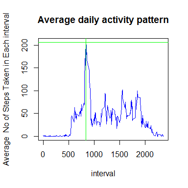

# PA1_template


```r
download.file("https://d396qusza40orc.cloudfront.net/repdata%2Fdata%2Factivity.zip",destfile = "data.zip",mode="wb")
unzip("data.zip")
knitr::opts_chunk$set(echo = TRUE,results = "asis",
                      fig.height = 4,fig.width = 4)
```
###downloading and saving data
Download the file and save in E:\sana\data science\assignmn-ds\data.zip
Read the file in r object,D


```r
d=read.csv("activity.csv",header=T,na.strings = "",stringsAsFactors = F)
library(dplyr)
```

```
## Warning: package 'dplyr' was built under R version 3.2.4
```

```
## 
## Attaching package: 'dplyr'
```

```
## The following objects are masked from 'package:stats':
## 
##     filter, lag
```

```
## The following objects are masked from 'package:base':
## 
##     intersect, setdiff, setequal, union
```
The variables included in this dataset are:
**steps**: Number of steps taking in a 5-minute interval (missing values are coded as NA)
**date**: The date on which the measurement was taken in YYYY-MM-DD format
**interval**: Identifier for the 5-minute interval in which measurement was taken

##convert date columns into required  formats##

```r
d$date<-as.Date(d$date,"%Y-%m-%d")
d$steps<-as.numeric(d$steps)
```

```
## Warning: NAs introduced by coercion
```

##1.What is mean total number of steps taken per day?**
 *install(dplyr)*

```r
d1<-group_by(d,date)
d2<-summarise(d1,sum=sum((steps),na.rm=T))
meansteps<-mean(d2$sum)
med<-median(d2$sum)
hist(d2$sum,xlab="Total No of Steps Taken Each Day",main=("histogram"),  xlim=range(d2$sum),breaks=20,col="pink")
abline(v=meansteps,col="green",lwd=4)
```


**Median of the total number of steps taken per day=1.0395\times 10^{4}.**  
**Mean of the total number of steps taken per day=9354.2295082.**

##What is the average daily activity pattern?*

```r
d3<-group_by(d,interval)
d4<-summarise(d3,average=mean((steps),na.rm=T))
with(d4,plot(interval,average,ylab="Average  No of Steps Taken in Each interval",main=("Average daily activity pattern"), type="l", xlim=range(d4$interval),col="blue"))
max<-max(d4$average)
x<-filter(d4,average==max)[1,1]
abline(h=max(max),v=x,col="green",lwd=1)
```



*on average across all the days in the dataset, the 5-min interval thatcontains the maximum number of steps= 835.

##IMPUTING na VALUES:
*replace all na values with mean of corresponding 5-MIN interval*

```r
na<-sum(!is.na(d$steps))
new<-merge(d3,d4,by="interval",all.x=T)
for (i in 1:nrow(d)){
        if (is.na(new$steps[i])==TRUE) {new$steps[i]=new$average[i]}
}
```

###**FINDING MEAN AND MEDIAN OF THE NEW DATASET WITH NA VALUES REPLACED**###

```r
new1<-group_by(new,date)
new2<-summarise(new1,sum=sum(as.numeric(steps),na.rm=T))
meanstepsnew<-mean(new2$sum)
mednew<-median(new2$sum)
hist(new2$sum,xlab="Total No of Steps Taken Each Day",main=("histogram"),  xlim=range(new2$sum),breaks=20,col="red")
abline(v=meanstepsnew,col="green",lwd=2)
```


**no of NA values= 15264**  
**Median of the total number of steps taken per day in new dataset=1.0766189\times 10^{4}.**  
**Mean of the total number of steps taken per dayin new dataset=1.0766189\times 10^{4}.**  

-(steps taken per day)  -  original dataset      -   new dataset   
-mean                   -9354.2295082       -1.0766189\times 10^{4}  
-median                 -1.0395\times 10^{4}                -   1.0766189\times 10^{4}


##Are there differences in activity patterns between weekdays and weekends?##

```r
new$day1<-factor(weekdays(new$date))
levels(new$day1)=list(weekday=c("Monday","Tuesday","Wednesday","Thursday",
                                "Friday"),weekend=c("Saturday","Sunday"))
new2<-group_by(new,interval,day1)
new3<-summarise(new2,steps=mean(steps)) 
library(lattice)
xyplot(steps~interval|day1,data=new3,layout=c(2,1),type="l",xlab="intervals",ylab="mean daily steps",title="Activity patterns on weekdays and weekends")
```


